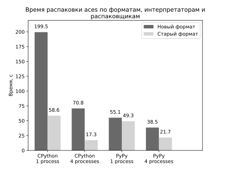

Вспомогательный инcтрументарий для работы с файлами конфигурации.
=================================================================

Среда выполнения
----------------

Linux, python3.7. Пакеты перечислены в `requirements-dev.txt`.

Режим распаковки текстов
------------------------

Демонстрационный скрипт находится в `tests/demo`. Он основан на `blk_unpacker.py` проекта `wt-tools` и реализует 
подобный интерфейс командной строки с форматами `strict_blk`, `json` и `json_2`. 

Для исполнения разместите директорию `wt_tools`, содержащую файл `blk_unpack.py` в пути поиска пакетов, используя 
переменную окружения или `.pth` файл.

Оценка времени распаковки aces.vromfs.bin_u новой и старой версии из директории в памяти для CPython и PyPy на 
Core i5-4670.

`blk_unpack_demo.py` с одним процессом.\
`blk_unpack_demo_mp.py` с числом процессов по количеству ядер.



**ВНИМАНИЕ**

Инструмент основан на представлении секции как `{name: [values]}`. Секция запоминает порядок только первого 
значения при добавлении `(name, value)` пары:

```
[(a, x), (b, y), (a, z)] -> {a: [x, z], b: [y]}
```

```
a -> x
a -> z
b -> y
```

Это может повлечь разрастание разности текстовых файлов, если вы прежде использовали в своих архивах распаковщик, 
основанный на представлении секции как `[(name, value)]`, способной запоминать порядок всех пар при добавлении

```
a -> x
b -> y
a -> z
```

Тестирование
------------

Настраиваемые директории в `pytest.ini`

* `binrespath` директория, содержащая директории `.bin_u` после прохода `vromfs_unpacker`
* `cdkpath` директория CDK
* `buildpath` выходная директория тестов

После настройки одноименные фикстуры для `pytest`содержат указанные пути. 
